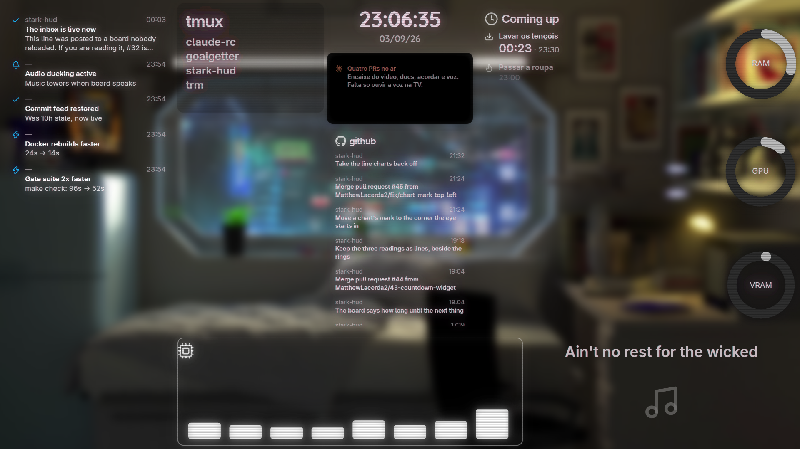

# stark-hud

A board on a television. Any Claude session writes to it over MCP and it
changes, live, in the room.

The screen has no keyboard and no mouse and nobody walks up to it. That single
fact decides everything below.



## Four things that follow from it

**You talk, and the room changes.** There is no editor and no admin page. A
session says *"put a countdown up, Lavar os lençóis at 23:30"* and the widget is
on the television before the sentence is finished. Moving, resizing, recolouring
and folding are all things you ask for by name.

**Nothing is chrome.** A widget is what it shows — no title bars, no buttons, no
scrollbars, no close button. What little exists for a pointer appears on hover,
so it never appears on the television at all. A chart's title sits inside the
plot rather than on a band above it, because a band costs height whether the
widget can spare it or not.

**It refuses, in sentences.** Widgets never overlap and the board never scrolls,
so running out of room is a normal outcome rather than an error — and whatever is
placing widgets is blind, so *"25 cells free, but none form a 16×9 rectangle"* is
more use than an exception. It is also why rearranging is a single batch judged
by the arrangement it produces: two widgets swapping places is illegal at every
step and perfectly legal at the end.

**It keeps running after you stop.** Panels feed themselves from a list of shell
commands, so the CPU chart is still right tomorrow. A countdown is given two
datetimes and counts down on its own, long after the session that set it has
gone. The board stores facts; the browser works out the readings.

## What that looks like

```
› group the notifications, github and media widgets
  Grouped 3 widgets into group 8f4801df234b — a group of 3 widgets

› now fold them away
  Folded — 3 widgets inside
  Board 32x18, 8 items. 296/576 cells used, 279 free.

› put the cpu chart where the feed is
  Not rearranged: chart f6dc572ce69f at (19,0) and feed 4271fcbd35a6
  at (19,0) would be in the same place
```

## The widgets

| kind | what it is |
| --- | --- |
| `list` | A heading and entries: icon, title, description, each colourable. The general case — most of the others are it with fewer parts. |
| `text` · `note` | One line of prose; the same on a tinted card. |
| `chart` | `line`, `bar`, `area`, `pie`, and `radial` gauges. Axes optional, colour thresholds optional, and its name costs no height. |
| `countdown` | How long until the next few things. Nothing writes to it; it counts down by itself. |
| `clock` | The time, with the date under it when there is room. |
| `inbox` · `feed` | Notifications as a phone's shade; things that happened elsewhere, newest first. |
| `media` | Audio, video or YouTube, with a queue, loop and maximise. |
| `image` · `video` | A local file, served by id — a path never reaches a URL. |
| `group` | A widget that holds widgets. Closed, they come off the board and it draws in their place: that is how one board carries more than one subject. |
| `box` | A frame drawn on the board. Decoration, and nothing else. |

Every widget carries its own colour, text scale, background and opacity, sits at
fractional coordinates, and can be dragged anywhere it fits. Each also has a
`description` that is never drawn — a note for whoever drives the board next.

Widgets move rather than cut: told to go somewhere else, one slides there.
Motion is a closed set of design tokens, like the colours, so nothing invents an
easing at runtime and the board goes on looking like one thing.

## Running it

```bash
docker compose up -d --build      # board on :8080, MCP on :8000/mcp/
python tools/agent.py             # the feeder, on the host
```

Point a Claude session at it:

```json
{ "mcpServers": { "stark-hud": { "type": "http", "url": "http://<lan-ip>:8000/mcp/" } } }
```

The agent lives **outside** the containers on purpose: it reads `/proc`,
`nvidia-smi` and `tmux`, none of which describe the right machine from inside
one. `make check` is the only quality gate and the whole of it — there is no CI,
so nothing catches a push whose gates were never run.

<details>
<summary>Architecture</summary>

```
                    ┌──────── stark-hud, one process ────────┐
                    │                                        │
   HTTP  /api  ─────┤  api/       handlers, one per route    │
   WS    /ws   ─────┤  services/  placement, groups, rules   │
   MCP   /mcp  ─────┤  repositories/  the board, and store.py│
                    │  schemas/   payloads, colour, icon, svg│
                    │                                        │
                    └──────┬──────────────────┬──────────────┘
                           │ board.hud        │ ws broadcast
                           ▼                  ▼
                      ┌─────────┐   ┌─────────┴──────────┐
                      │  disk   │   │  TV      · laptop  │
                      └─────────┘   └────────────────────┘
                           ▲
                           │ HTTP, every few seconds
                    ┌──────┴────────────────────────────────┐
                    │  tools/agent.py, on the host           │
                    │  runs tools/sources.toml → collectors  │
                    └────────────────────────────────────────┘
```

Four layers that stay in their lanes: `api/` translates HTTP, `services/`
decides, `repositories/` holds, `schemas/` defines what is legal. Placement is
settled on the server — a drag in a browser is a request, and the authoritative
answer comes back over the socket, so two viewers can never disagree. The board
is a `.hud` file written whole and atomically; pull the plug and it comes back,
widgets, notifications and folded groups alike.

</details>

## If you are a Claude reading this

You will work the rest out from the code faster than from prose, so this is
directions rather than instructions.

- The MCP tool docstrings are the real manual. They are written for you and they
  say the things a session cannot guess.
- `CLAUDE.md` is the contract, and it wins over this file.
- Call `list_items` instead of remembering where anything is — a human may have
  dragged it, and a widget's `description` may be a note another session left you.
- Call `board_status` before adding anything large. A full board answers with a
  sentence saying what is free, not an exception.
- Use `arrange` when more than one widget has to end up somewhere. One at a time,
  a swap is not merely slow but impossible on a full board.
- The board never fetches. If something should update on its own, it belongs in
  `tools/sources.toml`, not in a widget.
- Anything meant to survive belongs on the **item** (`description`, colour,
  position) rather than in its payload: a panel's payload is rewritten whole
  every few seconds.

## No authentication, deliberately

Anyone on the wifi can read and write the board. It shows the weather of one
machine on one television in one flat, and a token would buy nothing but the
feeling of a lock.

Which is why **commands live in `tools/sources.toml` on the host and never on
the board**. If the board carried commands, anything on the network could run
code here. A display should not be a remote shell.

For the decisions and their reasons, see [`SPEC.md`](./SPEC.md). For how to work
in this repository, [`CLAUDE.md`](./CLAUDE.md).
